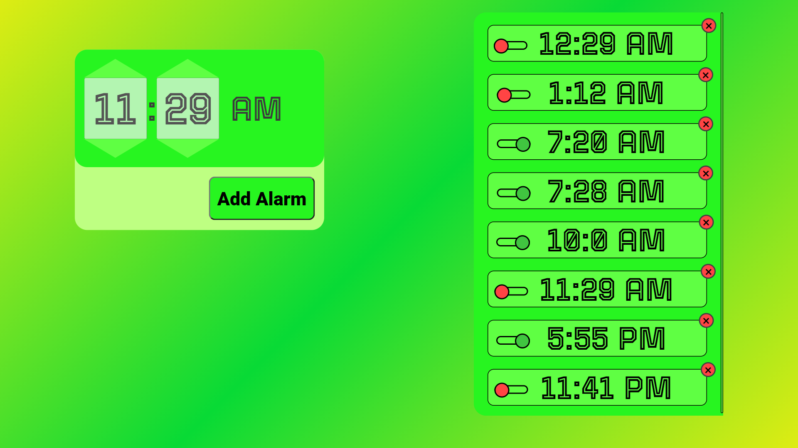
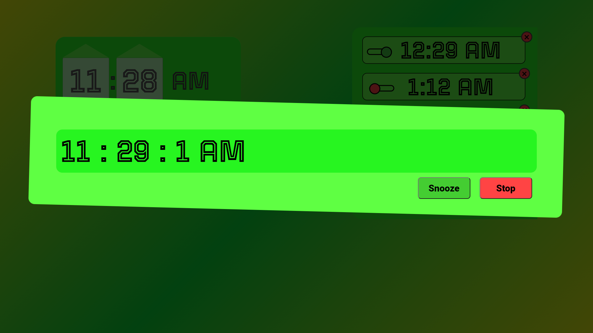
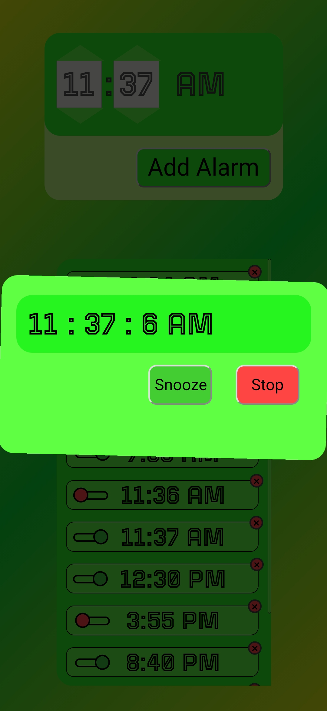
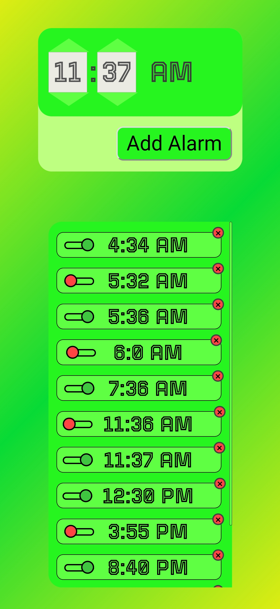

# Alarm-app
[Project Link](https://pankj6342.github.io/alarmapp.github.io/)
---

> ### Features: 
>- Fully responsive app
>- Attractive Design
>- Alarms are safely stored in your browser's localStorage
>- Sync time 0.5 sec which will ring instantly on time
>- While setting alarm
>   - Single click - 1 step
>   - Double click - 4 steps
>- Toggle switch to enable/disable alarm
>- Delete alarm using red cross

---
>### Some screenshots:
>#### PC version: 
>
>
>
>---
>#### Mobile version: 
> 
> 
